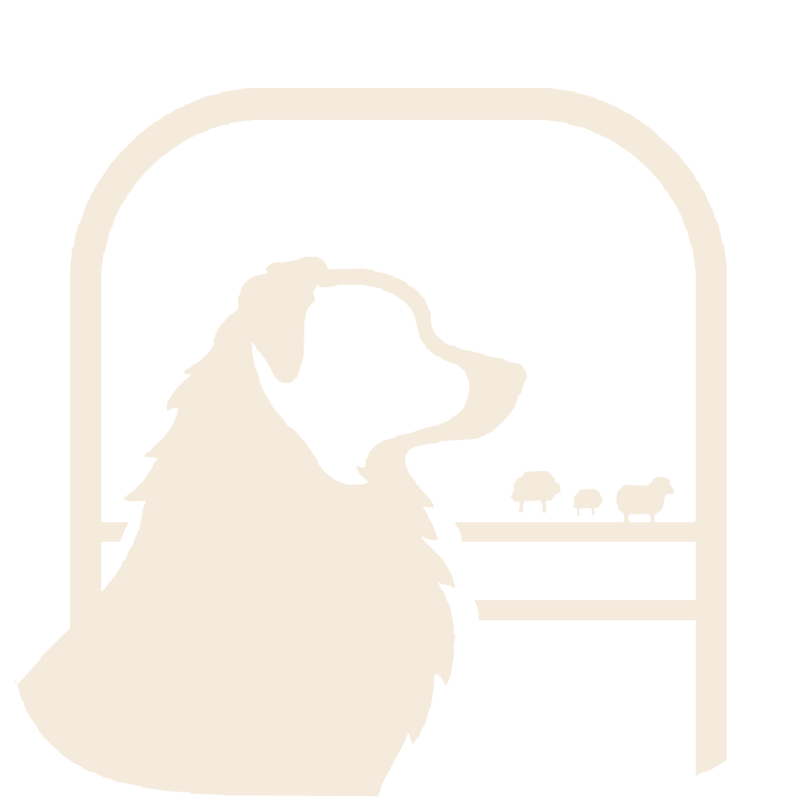

<p align="center">
  
</p>
<!-- TODO: add docs/screenshot.png of the window with two or three session tabs once the tab indicators land -->

<h1 align="center">Paddock</h1>

<p align="center"><strong>A paddock for your herdr sessions.</strong></p>

<p align="center">
  A small native macOS app that gives every <a href="https://herdr.dev">herdr</a> session its own side tab
  inside a real <a href="https://ghostty.org">Ghostty</a> terminal, so your AI coding agents stay in their pens
  and you can see which one is waiting for you.
</p>

---

If you run more than one herdr session, say one for work and one for your own projects, each lives in its
own terminal window, and from the one you are looking at it is hard to tell whether an agent in another one
has stopped and is waiting. Paddock puts them in one window, one tab per session, with a mark on the tab
that says what its agents are doing.

## Why you might like it

- **Every session in one window.** Tabs sit down the side like a chat app, one per named herdr session.
  Once opened, a tab keeps its terminal alive, so switching back does not reload or reconnect it.
- **A real Ghostty, not a look-alike.** Each tab is a genuine Ghostty terminal surface through
  [libghostty](https://github.com/Lakr233/libghostty-spm). Paddock loads your `~/.config/ghostty/config`,
  so theme, font, padding, light and dark switching and keybindings are the ones you already have; the only
  settings it adds are the ones needed to launch herdr in each tab.
- **Work and personal never touch.** `herdr --session work` and `herdr --session personal` are separate
  herdr servers with separate agents and separate sockets. Paddock just puts them side by side.
- **It knows when an agent needs you.** A tab shows a red badge with a number when spaces in that
  session have an agent waiting for your input, and how many. With nothing waiting, a green check means something
  finished that you have not looked at yet, and a quiet blue dot means work is still going on. Every tab
  reports from the moment Paddock starts, so a session you are not looking at can still get your
  attention, and VoiceOver reads the same counts.
- **Stays out of herdr's way.** Beyond the standard application menu and the sidebar toggle, Paddock
  defines no Command shortcuts, so the chords herdr and your agents expect reach them. Hide the sidebar
  and the window becomes a plain Ghostty window titled with the session's name.
- **Works with the sessions you already have.** Paddock lists your existing herdr sessions on first
  launch and adds nothing of its own to them. Closing a tab never stops a session; that takes an explicit "Stop Session…" with a
  confirmation. If herdr detaches or exits, the tab shows a Reattach button instead of a dead shell.
- **Small and native.** AppKit and Swift 6 with strict concurrency, no Electron, no web view, a few
  thousand lines of Swift.

## Install

Paddock is built from source for now.

**You need**

- macOS 14 or newer
- [herdr](https://herdr.dev) (`brew install herdr`)
- Xcode 26 and [XcodeGen](https://github.com/yonaskolb/XcodeGen) (`brew install xcodegen`)

**Build and run**

Clone the repository, then:

```sh
make run
```

`make run` generates the Xcode project, builds it into `DerivedData`, and opens the app. Once you have it,
drag `DerivedData/Build/Products/Debug/Paddock.app` to `/Applications` if you like.

**One-time setup if your Ghostty config names a theme.** libghostty ships without theme files, so a
`theme = …` line would make Ghostty reject your whole config. Link the themes from Ghostty.app once:

```sh
ln -s /Applications/Ghostty.app/Contents/Resources/ghostty/themes ~/.config/ghostty/themes
```

## Using it

**First launch.** Paddock asks herdr for your sessions and makes a tab for each one. Click a tab and it
runs `herdr --session <name>` inside; attach, detach and work in herdr exactly as you would in a plain
terminal. A tab whose session is not running is drawn dimmed; hover it to see why ("Session not running",
"Connecting…", "Reconnecting…").

**Adding a session.** The `+` tile lists any herdr session that has no tab yet, then "New Session…" to
create one.

**The tab's menu.** Right-click a tab to rename it, give it a colour, remove it, or stop the herdr session
behind it. Renaming and recolouring are Paddock's own labels; the herdr session keeps its name.

**Files.** Drop files or folders onto a terminal and their paths are pasted at the prompt, shell-quoted
when needed.

**Hiding the sidebar.** View ▸ Hide Sidebar, or Ctrl+Cmd+S. Paddock remembers the choice. The sidebar
follows the background hue of Ghostty's active light or dark theme.

**Full screen.** Window ▸ Enter Full Screen, or Ctrl+Cmd+F, uses the standard macOS full-screen Space and
animation. The title bar stays hidden until macOS reveals it at the top edge; use the same command to
leave full screen.

**Where things live.** Tabs, names and colours are in
`~/Library/Application Support/Paddock/tabs.json`. Paddock never writes to herdr's or Ghostty's config.

## When something looks wrong

- **A tab opens a plain shell instead of herdr.** Your Ghostty config almost certainly uses a
  `theme = dark:…,light:…` line. Paddock handles that one itself, so if a tab still shows a bare shell,
  look for any other conditional value in the config. The full story is in
  [docs/internals.md](docs/internals.md#troubleshooting).
- **The whole config is rejected.** Do the themes symlink above.
- **herdr says it is already running inside herdr.** Paddock strips inherited `HERDR_*` markers before it
  starts a tab, so this should not happen; if it does, launch Paddock from Finder rather than from inside a
  herdr pane and open an issue.
- **The Dock shows a blank icon after a rebuild.** This is usually the Launch Services icon cache, which
  is keyed on the app bundle's timestamp. Quit the app, `touch` the `.app`, run `killall Dock`, and open
  it again.

## Contributing

`make test` runs the unit tests. Suites that need a live herdr are off unless you opt in; how to run them,
how the app is put together, and why some of it is the way it is are in
[docs/internals.md](docs/internals.md). Bug reports with a herdr version and a copy of the relevant
Ghostty config lines are the most useful kind.

## The name and the dog

A paddock is a fenced field. herdr does the herding; Paddock is the enclosure the herding happens in. The
dog on the icon is an Australian Shepherd, because the author's is.

## Related

- [herdr](https://herdr.dev), the terminal workspace manager for AI coding agents that Paddock wraps.
- [Ghostty](https://ghostty.org) and [libghostty-spm](https://github.com/Lakr233/libghostty-spm), the
  terminal inside every tab.
- [Heeler](https://github.com/ZingerLittleBee/Heeler), a native iOS console for herdr, if you want the
  same view of your agents from a phone.
